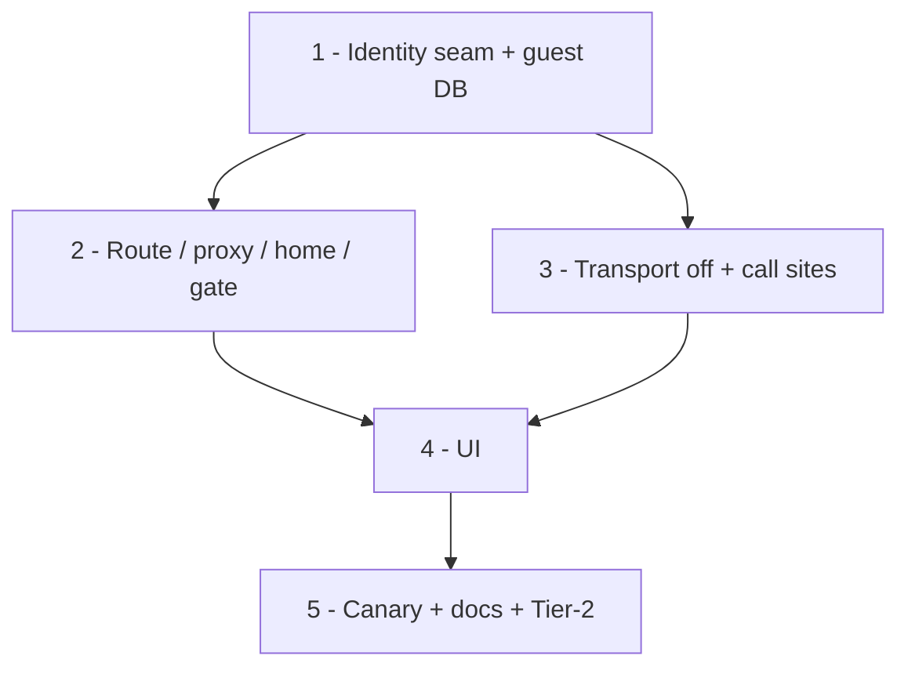

# M11 — Guest mode (US-15) — Execution Plan

> Resolved by `/grill-me` on 2026-09-28. Independent of M10 (parked on `m10-ship`, draft PR #6).
> Branch: `feat/guest-mode`. **No database migration** — nothing server-side changes.

## Goal

The repo is on the owner's CV, so a recruiter must be able to *try the app*. Today they can't:
`proxy.ts` sends anyone without an allowlisted Google session to `/login`. Guest mode lets a
visitor use the full app **on their own device only**, while it stays **structurally impossible**
for anyone but Javi to write rows or upload images to Supabase.

The one-line rule: **guest mode swaps the identity source and switches off the sync transport;
everything in between is the same code Javi runs.** The demo *is* the real app.

## Ground rules for every task

- `pnpm lint`, `pnpm typecheck`, `pnpm test`, `pnpm build` pass before a task counts as done.
- One conventional commit per task.
- Guest-mode checks go through **one seam** (`src/lib/auth/identity.ts`). No component reads the
  cookie itself and no module re-derives "am I a guest".
- Never weaken Javi's path. Every change is `if (guest) { … } else { unchanged }`, and the
  existing 359 tests pass untouched.

## Definition of done

1. On `/login` and `/denied`, **"Try it as a guest"** lands a visitor on the calendar with no
   Google account.
2. A guest can do everything Javi can (add a photo, cut a stamp, move/resize/rotate/delete +
   undo, upload and place stickers, switch frame and week start, change month, export PNG),
   and all of it survives a reload.
3. **No-network canary (vitest):** the whole guest flow above runs with the Supabase client mocked,
   and the test asserts it was **never called**.
4. Unit tests: DB-name selection, session-beats-cookie, the proxy/home guest rules,
   `editingLocked()` false for guests on previews, and no sticker seeding for guests.
5. **Tier-2 on the PR preview:** enter as a guest on the phone, add photos, then check the
   Supabase dashboard (no new rows or storage objects) and the network tab (no Supabase
   requests). Then sign in as the owner **on the same phone** and confirm none of the guest's
   data shows up.
6. `CLAUDE.md` status + `PLAN.md` updated; README gets a "try it as a guest" line for the CV.

## Resolved design decisions

### 1. A guest has no Supabase session at all

"Try it as a guest" sets a cookie, **`jj_guest=1`**, and that is the whole identity. Rows use a
fixed **`GUEST_USER_ID = "guest"`**.

This gives two independent barriers. The client never starts sync (decision 5). Even if a bug
made a request anyway, there is no JWT, so RLS (`auth.uid() = user_id`) and the private bucket
reject it.

Rejected: **Supabase anonymous sign-in** (`signInAnonymously`). Anonymous users *are*
`authenticated` to RLS, so `auth.uid() = user_id` passes and any guest could fill the tables
and the bucket unless every policy grew an `is_anonymous` check. It also creates an
`auth.users` row per visit. That is exactly the pollution this story exists to prevent.

The cookie is unsigned **on purpose**: hand-setting it grants nothing server-side (no rows, no
storage, no session). It only unlocks pages that render from the visitor's own IndexedDB.

### 2. Guests get their own database, `"javis-journal-guest"`

`JournalDB` takes its IndexedDB name as a constructor argument. The `db` singleton picks it
**once, at module load**, from `isGuest()`. Every mode switch is a full page navigation (guest
route → `/`, sign-in → `/`, exit → `/login`), so the singleton never has to change mid-session,
and none of the 18 importers of `db` learn that guest mode exists.

Why: with one shared database, a guest tap on Javi's phone would mix a stranger's stamps into
her journal and queue `user_id = "guest"` outbox rows. Her next sign-in would push those, RLS
would reject them, and they would sit quarantined as poison pills.

Rejected: filtering every query by `user_id`. It touches every read in `queries.ts` and the
outbox, and `image_blobs` has no `user_id` column at all.

### 3. Guest data persists in that browser indefinitely; Exit only clears the cookie

A returning guest finds their old data (this is the honest demo of local-first). **"Exit guest
mode" clears `jj_guest` and nothing else.** The guest database is *not* deleted, and a later
"Try it as a guest" in the same browser restores it.

**Accepted cost:** on a shared machine, a previous guest's photos stay until the browser's site
data is cleared.

Consequence (no action needed): M3's original eviction only evicts originals whose upload is
*durable* (`eviction.ts`), and a guest never uploads, so **guest originals are never evicted**.
Each guest photo keeps original + main + thumb on disk. That is harmless for a demo session and
is the safe direction for that interlock.

### 4. Entry, precedence, exit

- **Entry:** a secondary **"Try it as a guest"** button under "Sign in with Google" on `/login`,
  and the same button on `/denied`, where a recruiter who tried Google first lands.
  Both hit **`GET /api/auth/guest`**, which sets `jj_guest=1` (`httpOnly: false` so the client
  can read it for decision 2, `sameSite: lax`, `path: /`, 1-year max-age) and redirects to `/`.
  The route goes on the proxy matcher's exclusion list next to `api/auth/gate`.
- **A real session always wins.** If a Supabase user exists, guest mode is off even with the
  cookie present. `/api/auth/gate` **clears `jj_guest`** on a successful sign-in, so the client
  never opens the guest database for Javi. Signing in never deletes the guest database; it just
  stops being opened.
- **`proxy.ts`:** no user + guest cookie → pass through. `/login` + guest cookie → redirect to `/`
  (the same as a signed-in user). The `/preview` bypass is unchanged.
- **`src/app/page.tsx`** (a server component with its own `getUser()` check) accepts the guest
  cookie the same way. Both server checks call one server-side helper, `isGuestRequest(cookies)`,
  exported from the identity seam's server half, so the two gates cannot drift.
- **Exit:** in the 3-dots menu, "Logout" becomes **"Exit guest mode"** for guests. It deletes the
  cookie (client-side `document.cookie` expiry) and then `window.location.assign("/login")`. There
  is no `signOut()` call and no confirm dialog.

### 5. The client seam: identity source swapped, sync transport off

New **`src/lib/auth/identity.ts`**, which is pure and DOM-guarded:

- `isGuest(): boolean` reads `jj_guest` from `document.cookie` (it is `false` on the server and in
  tests unless stubbed).
- `GUEST_USER_ID = "guest"`.
- `guestProfileBootstrap()`: on a guest's first boot, it writes
  `{ user_id: "guest", start_of_week, selected_frame: DEFAULT_FRAME, fireworks_seen: false, … }`
  straight to Dexie **if no profile row exists**. For Javi that row only ever arrives from the
  first pull, which a guest never runs. Without it, `useProfile().userId` stays null forever and
  the frame and week-start writes throw.

The call sites that currently resolve identity through Supabase:

| Site | Guest behaviour |
|---|---|
| `lib/image/ingest.ts` `currentUserId()` | returns `GUEST_USER_ID` |
| `lib/stamp/ingest-stamp.ts:62` | returns `GUEST_USER_ID` |
| `lib/db/mutations.ts` `setStartOfWeek`/`setSelectedFrame` fallback | `GUEST_USER_ID` (normally unreached: bootstrap made the row) |
| `lib/sync/engine.ts` `startSyncLoop` / `flushNow` | **no-op**, the single transport choke point: no pull, no push, no backoff timers |
| `components/SyncBoot.tsx` | returns early when guest (belt and braces with the engine guard) |
| `lib/image/thumb-url.ts` signed-URL fallback | skipped: a missing local blob renders blank rather than firing a doomed Storage request |
| `components/calendar/CalendarMenu.tsx` logout | "Exit guest mode" (decision 4) |

**`markDirty` still writes the outbox in guest mode.** The write path stays byte-identical to
Javi's, so the demo exercises the real code, and a never-drained outbox in a throwaway database
costs nothing. Rejected: skipping the outbox for guests, which would add a branch to the one
function that must never be wrong.

### 6. First entry: an empty journal, no seeded stickers

A guest lands on the current month, empty, with the default frame and an **empty sticker tray**.
The `seedStickers()` effect in `Calendar.tsx` (~line 243) is skipped for guests, and so is the
`repairStickerThumbs()` in front of it. That also keeps Javi's personal sticker art out of the demo.
A guest who wants stickers uploads their own through the tray's `＋` tile.

Rejected: a pre-filled demo month (bundled photos in a public repo) and a first-run popup.

### 7. The preview guard does not apply to guests

`editingLocked()` becomes `NEXT_PUBLIC_VERCEL_ENV === "preview" && !isGuest()`. The guard exists
because a preview talks to the *production* database, and a guest cannot reach any database. It
also means **every future PR preview is a full, zero-risk sandbox**: enter as a guest and test
the real editor. Javi's signed-in session on a preview stays locked, exactly as today.

### 8. The app says you are a guest

A small pill beside the month title: **"Guest · saved on this device only"**. It is always
visible to guests and never shown to Javi. It reassures a recruiter that their photos go nowhere,
and it tells the owner at a glance which world they are in while testing a preview.
The pill must not change the fit model: it sits in the title row, which is outside `FramedGrid`,
so `cellW` and the export are untouched. Verify this in the harness.

## Tasks

### Task 1 — The identity seam + guest database  *(blocks 2–5)*
`src/lib/auth/identity.ts` (`isGuest`, `GUEST_USER_ID`, `guestProfileBootstrap`, server-side
`isGuestRequest`); `JournalDB(name)` + a singleton picking `"javis-journal-guest"` for guests.
Tests: name selection with the cookie present/absent; bootstrap writes once and never
overwrites an existing row.

### Task 2 — Server side: route, proxy, home, gate  *(depends on 1)*
`GET /api/auth/guest` (set cookie → `/`); matcher exclusion; `proxy.ts` guest pass-through and
the `/login` bounce; `page.tsx` accepts guests; `/api/auth/gate` clears `jj_guest` on success.
Tests: the proxy decision table (user / guest / both / neither × `/`, `/login`).

### Task 3 — Client transport + identity call sites  *(depends on 1)*
Engine guards (`startSyncLoop`, `flushNow`), `SyncBoot`, ingest + ingest-stamp + mutations
identity, `thumb-url` fallback skip, `editingLocked()` for guests, no seeding or repair for guests,
and the bootstrap call on guest boot.

### Task 4 — UI  *(depends on 2, 3)*
"Try it as a guest" on `/login` + `/denied`; the guest pill; "Exit guest mode" in the 3-dots
menu. Verify in the browser preview: login → guest → calendar → add a photo → reload → still
there → exit → `/login`.

### Task 5 — The no-network canary + docs  *(depends on 1–4)*
The vitest canary from DoD 3 (fake-indexeddb, a mocked `@/lib/supabase/browser` whose every
method throws, and the full guest flow). Update `CLAUDE.md` (status + layout: the identity seam),
`PLAN.md`, and the README line. Then do the Tier-2 run on the PR preview (DoD 5).

## DAG

Tasks 2 and 3 are independent but small and share the seam, so **build directly** on
`feat/guest-mode`. `/parallel-plan` isn't worth the worktree risk here.

## Manual steps (owner — not for agents)

- None in Supabase: no migration, no policy change, no allowlist change.
- The Tier-2 run on the PR preview (DoD 5), including the dashboard check that nothing was written.
- Optional: once merged, put the production URL + "Try it as a guest" on the CV.

## As built (2026-10-04, `feat/guest-mode`)

The eight decisions stand. Where the build added to or refined them:

- **The pill is bottom-centre, not beside the title.** Pinned above the title it was clipped
  whenever the layout is height-bound (a phone's close-up), because the title then shares the top
  bar's row. It is now `fixed`, `pointer-events-none`, in the slot the preview-lock note uses (the
  two never show together). Being out of flow, it still cannot touch `titleH`, `cellW` or the
  export.
- **"Session wins" is enforced at two more points.** `GET /api/auth/guest` never sets the cookie
  for a signed-in user (it is linked from `/denied`, which the proxy does not gate), and the proxy
  clears a `jj_guest` that rides along with a real session. The cookie and a session therefore
  never coexist, which is what the client's cookie-only DB choice relies on.
- **One more signed-URL site.** The export's `signPaths` (`src/lib/export/data.ts`) was missing
  from the decision-5 table; it skips for guests like `thumb-url`. `pullNow` is guarded too, and
  `seedStickers`/`repairStickerThumbs` refuse for guests themselves, beside the `Calendar` effect.
- **`guestProfileBootstrap` lives in `src/lib/auth/guest-bootstrap.ts`.** `@/lib/db` imports the
  identity seam at module load, so the seam cannot import `@/lib/db` back (an import cycle).
- **`Calendar` takes a `guest` prop** from the home page's server gate, so the pill and the
  preview-lock note render the same on the server and the client (no hydration mismatch).
- **The canary** (`src/lib/auth/guest-canary.test.ts`) runs the real ingest, mutations, engine,
  display seam and `composeMonthPng`. The lowest seams: the image decoder and the canvas
  rasterizer are mocked, and the stamp bake is given as a ready `BakeResult`. Removing either the
  engine's `flushNow` guard or `thumb-url`'s guard turns it red.
